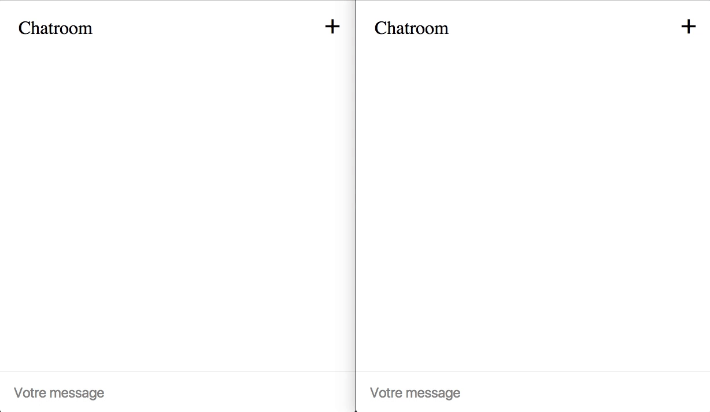

# Challenge Chatroom

L'objectif : coder un *chat* en NodeJS + React + Redux :scream:




## Coté back : Node.js & socket.io

Un chat, c'est *grosso modo*, et le plus souvent, plein de clients (navigateurs) qui communiquent ensemble à travers un serveur central. La communication peut s'établir de bien des manières, nous allons ici utiliser un WebSocket.

> **Installez les dépendances nécessaires avec `yarn add express socket.io`.**

### socket.io

Le serveur utilise la librairie [socket.io](https://socket.io/) pour réceptionner et renvoyer les requêtes à tous les clients connectés, au moyen d'un [WebSocket](https://developer.mozilla.org/fr/docs/WebSockets).

Pour réaliser un chat, le front doit donc envoyer au serveur, *via* le WebSocket socket.io, un objet décrivant le message. Le serveur renverra ce message tel quel à tous les clients connectés, mais en rajoutant au passage un `id` unique à chaque message.

Par exemple :

1. Un client envoie un objet au serveur :
```js
{
  user: 'Perceval',
  message: 'Je suis souvent victime des colifichets',
}
```

2. Le serveur renverra à tous les clients connectés :
```js
{
  user: 'Perceval',
  message: 'Je suis souvent victime des colifichets',
  id: 14,
}
```

3. Un autre client envoie un message :
```js
{
  user: 'Arthur',
  message: 'Je comprends rien',
}
```

4. Le serveur renverra à tous les clients connectés :
```js
{
  user: 'Arthur',
  message: 'Je comprends rien',
  id: 15,
}
```

---

## Coté front : React & Redux

### React

Vous savez faire, rien à signaler :smiley:

### WebSocket

Le serveur socket.io et un client chat communiquent via un WebSocket.

Pour utiliser ce WebSocket et envoyer/réceptionner des messages entre des applications clientes, chaque client doit utiliser une librairie JavaScript intitulée socket.io-client.js pour se connecter au WebSocket partagé.

Cette librairie JS peut être installée à la main, mais en mode développement, elle est aussi directement mise à disposition par le serveur socket.io à l'adresse http://localhost:3001/socket.io/socket.io.js. Une application cliente peut donc directement récupérer cette librairie JS dans son HTML, ce qui met à disposition la variable globale `window.io`, c'est-à-dire le client socket.io.

Dans votre middleware, vous pourriez donc créer une variable pour stocker l'instance de la connexion au WebSocket :

```js
// Stockera la connexion au WebSocket client émis par le serveur.
let socket;
```

Ensuite, toujours dans le middleware, vous pourriez écouter une action Redux (par exemple `'WEBSOCKET_CONNECT'`), en réaction à laquelle vous déclencheriez effectivement la connexion au WebSocket :

```js
case WEBSOCKET_CONNECT:
  socket = window.io(); // connexion au WebSocket
```

> On peut imaginer dispatcher cette action Redux au chargement de la page : par exemple dans le `componentDidMount` de `App`, ou juste après le `render` principal de ReactDOM. Ou autre solution qui fonctionne :p

Ensuite, vous pourriez définir un écouteur d'évènement avec la méthode `.on()` de socket.io, pour dispatcher une action Redux lorsqu'un message sera réceptionné en provenance du serveur :

```js
case WEBSOCKET_CONNECT:
  socket = window.io(); // connexion au WebSocket
  socket.on('send_message', (message) => {
    store.dispatch(receiveMessage(message));
  });
```

Voilà pour ce qui est de la *réception* des messages… mais il nous faut aussi pouvoir *envoyer* un message !

Pour ce faire, même stratégie : on pourrait dispatcher une action Redux qui serait écoutée par le middleware, lequel pourrait envoyer un message via le `socket`, en utilisant la méthode `.emit()` de socket.io :

```js
case MESSAGE_SEND:
  // ...
  socket.emit('send_message', message);
```

---

À partir de là, tout devient possible ! Il ne reste plus qu'à vous lancer ! :muscle:
